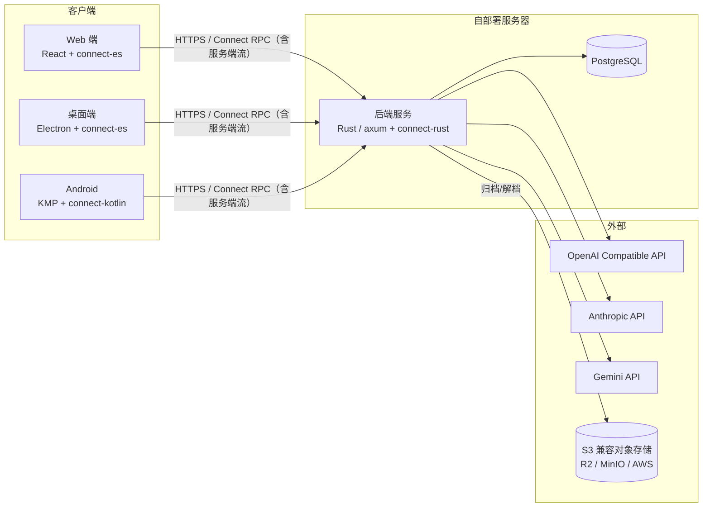

# Lemma — 技术设计文档（v0）

> 对应 PRD：`docs/prd/v0-prd.md` | 版本：v0.7 | 状态：评审中
>
> 本文档只描述粗粒度架构与关键技术选型；各领域设计在实现推进到对应阶段时再逐节填写，填写前不预设实现细节。
> 文档只保留当前状态，历史变更由 git 提交记录承载。

## 1. 系统架构



关键原则：

- **proto 契约是唯一事实源**：`proto/` 目录由 buf 管理，三端代码全部从同一份 `.proto` 生成
- **活跃数据只增不删**：删除被归档制取代
- **实时通道用 Connect 服务端流**（含常驻的同步 Watch 流，即"永远在线"的连接）；WebSocket 保留为未来真双向需求（语音流、Agent 插话）的附加通道，MVP 不建

## 2. 技术选型

| 领域          | 选择                                                                     | 说明                                                                               |
| ------------- | ------------------------------------------------------------------------ | ---------------------------------------------------------------------------------- |
| RPC 框架      | Connect RPC（connect-rust / connect-es / connect-kotlin）                | 一份 proto 契约驱动三端；connect-rust 尚 pre-1.0，退路 tonic + tonic-web，契约不变 |
| 后端          | Rust + axum + tokio + sqlx                                               | —                                                                                  |
| 数据库        | ParadeDB（PostgreSQL，含 pgvector / pg_search）                          | 为未来 RAG 预留                                                                    |
| 认证          | JWT access token（短寿命）+ refresh token（存库、轮换）；argon2 密码哈希 | 无状态校验 + 可吊销                                                                |
| 对象存储      | aws-sdk-s3（自定义 endpoint）                                            | AWS S3 / R2 / MinIO 一套代码通吃                                                   |
| Web / 桌面    | React（Vite）+ Electron 套壳                                             | Zustand 状态、Dexie 离线缓存、shadcn/ui + Tailwind v4                              |
| 前端分发      | Web 构建产物嵌入后端二进制                                               | 与 API 同源服务，免 CORS，前后端版本天然一致                                       |
| 移动端        | KMP + Compose Multiplatform                                              | SQLDelight 缓存；只做 Android，为 iOS 预留                                         |
| 国际化 / 主题 | react-i18next（中英双语）；明 / 暗 / 跟随系统                            | 跟随浏览器/系统，可切换、持久化                                                    |

## 3. Monorepo 布局

```
lemma/
├── Cargo.toml               # Rust workspace 根
├── justfile                 # 统一任务入口（proto lint/build/gen）
├── package.json             # npm workspace 根（web 及未来的 desktop）
├── docker-compose.yml       # 开发环境编排（数据库）
├── crates/
│   ├── server/              # bin：入口 + 全部业务逻辑
│   ├── db/                  # lib：连接池、实体、查询、迁移
│   └── proto/               # lib：proto 编译期生成（connectrpc-build）
├── proto/                   # 契约唯一事实源（buf 管理）
│   └── lemma/v1/
├── web/                     # React Web 端（Vite）
├── desktop/                 # Electron 壳，复用 web/ 产物（M3）
├── mobile/                  # KMP + CMP（M4）
│   ├── shared/
│   └── androidApp/
├── deploy/                  # 部署编排（server + db）+ .env.example（M5）
└── docs/
```

**双端代码生成管线**（Rust 与 TS 均从 `proto/` 生成，均不入 git）：

- Rust：`crates/proto/build.rs` 编译期经 connectrpc-build 生成到 OUT_DIR，`cargo build` 自动重生成
- TS：`just proto-gen` 经 buf + 本地 protoc-gen-es 插件生成到 `web/src/gen/`
- 契约变更后：`just proto-lint && just proto-build && just proto-gen && cargo build` 全绿再提交

## 4. 后端架构

（待填写）

## 5. 数据与同步

（待填写）

## 6. 接口设计

契约放 `proto/lemma/v1/`，正式定义以 proto 为准（已全部定稿，buf STANDARD 通过）：

| 服务                | 职责                                                          |
| ------------------- | ------------------------------------------------------------- |
| AuthService         | 注册（首个用户 owner）、登录、刷新（轮换）、登出、当前用户   |
| ProviderService     | 供应商 CRUD（Key 脱敏返回）+ 远程模型列表拉取                 |
| ConversationService | 会话/消息管理、归档、解档、归档列表、彻底删除                 |
| ChatService         | 发消息（服务端流）、中断、续传（服务端流，按字符 offset 重放）|
| SyncService         | 增量 Pull（游标 + 循环分页）+ 常驻 Watch 流（提示 + 心跳）    |

约定：认证走 `Authorization: Bearer` 请求头；所有数据按当前用户做归属校验；响应一律独立命名的 XxxResponse 包裹，不复用实体消息；实体不带协议字段（sync_seq 等只出现在对应协议载荷中）。

## 7. 客户端架构

（待填写）

## 8. 部署

（待填写）
