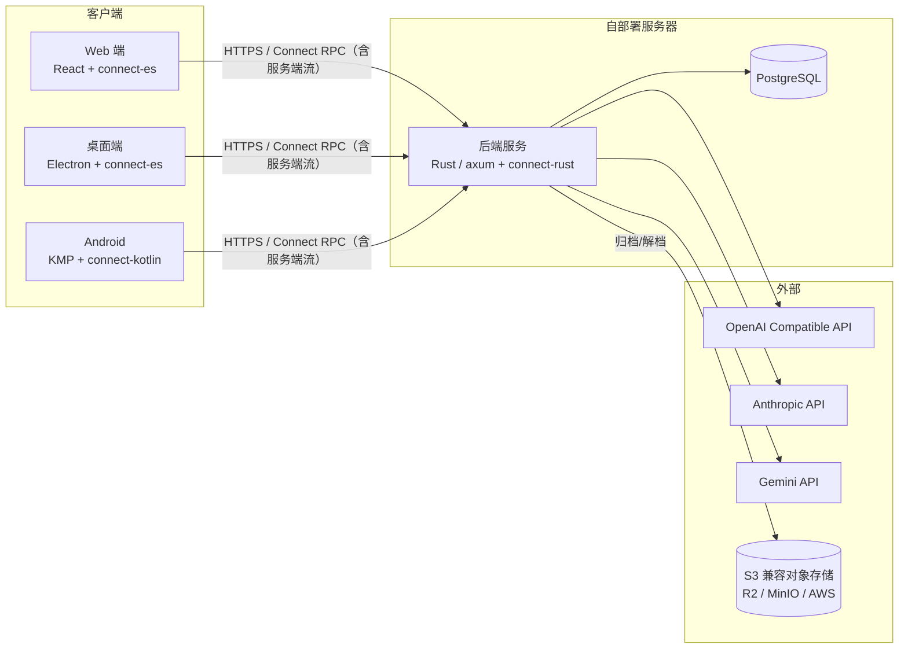

# Lemma — 技术设计文档（v0）

> 对应 PRD：`docs/prd/v0-prd.md` | 版本：v0.7 | 状态：评审中
>
> 本文档只描述粗粒度架构与关键技术选型；各领域设计在实现推进到对应阶段时再逐节填写，填写前不预设实现细节。
> 文档只保留当前状态，历史变更由 git 提交记录承载。

## 1. 系统架构



关键原则：

- **proto 契约是唯一事实源**：`proto/` 目录由 buf 管理，三端代码全部从同一份 `.proto` 生成
- **活跃数据只增不删**：删除被归档制取代
- **实时通道用 Connect 服务端流**（含常驻的同步 Watch 流，即"永远在线"的连接）；WebSocket 保留为未来真双向需求（语音流、Agent 插话）的附加通道，MVP 不建

## 2. 技术选型

| 领域          | 选择                                                                     | 说明                                                                               |
| ------------- | ------------------------------------------------------------------------ | ---------------------------------------------------------------------------------- |
| RPC 框架      | Connect RPC（connect-rust / connect-es / connect-kotlin）                | 一份 proto 契约驱动三端；connect-rust 尚 pre-1.0，退路 tonic + tonic-web，契约不变 |
| 后端          | Rust + axum + tokio + sqlx                                               | —                                                                                  |
| 数据库        | ParadeDB（PostgreSQL，含 pgvector / pg_search）                          | 为未来 RAG 预留                                                                    |
| 认证          | JWT access token（短寿命）+ refresh token（存库、轮换）；argon2 密码哈希 | 无状态校验 + 可吊销                                                                |
| 对象存储      | aws-sdk-s3（自定义 endpoint）                                            | AWS S3 / R2 / MinIO 一套代码通吃                                                   |
| Web / 桌面    | React（Vite）+ Electron 套壳                                             | Zustand 状态、Dexie 离线缓存、shadcn/ui + Tailwind v4                              |
| 前端分发      | Web 构建产物嵌入后端二进制                                               | 与 API 同源服务，免 CORS，前后端版本天然一致                                       |
| 移动端        | KMP + Compose Multiplatform                                              | SQLDelight 缓存；只做 Android，为 iOS 预留                                         |
| 国际化 / 主题 | react-i18next（中英双语）；明 / 暗 / 跟随系统                            | 跟随浏览器/系统，可切换、持久化                                                    |

## 3. Monorepo 布局

```
lemma/
├── Cargo.toml               # Rust workspace 根
├── justfile                 # 统一任务入口（proto lint/build/gen）
├── package.json             # npm workspace 根（web 及未来的 desktop）
├── docker-compose.yml       # 开发环境编排（数据库）
├── crates/
│   ├── server/              # bin：入口 + 全部业务逻辑
│   ├── db/                  # lib：连接池、实体、查询、迁移
│   └── proto/               # lib：proto 编译期生成（connectrpc-build）
├── proto/                   # 契约唯一事实源（buf 管理）
│   └── lemma/v1/
├── web/                     # React Web 端（Vite）
├── desktop/                 # Electron 壳，复用 web/ 产物（M3）
├── mobile/                  # KMP + CMP（M4）
│   ├── shared/
│   └── androidApp/
├── deploy/                  # 部署编排（server + db）+ .env.example（M5）
└── docs/
```

**双端代码生成管线**（Rust 与 TS 均从 `proto/` 生成，均不入 git）：

- Rust：`crates/proto/build.rs` 编译期经 connectrpc-build 生成到 OUT_DIR，`cargo build` 自动重生成
- TS：`just proto-gen` 经 buf + 本地 protoc-gen-es 插件生成到 `web/src/gen/`
- 契约变更后：`just proto-lint && just proto-build && just proto-gen && cargo build` 全绿再提交

## 4. 后端架构

（待填写）

## 5. 数据与同步

**权威在服务端**。PostgreSQL 里 conversations/messages 每行带 `sync_seq`，取自一个全局序列；所有 UPDATE 必须显式 `sync_seq = nextval('sync_seq')`（列默认值只作用于 INSERT），保证任何变更都能被增量同步看见。

**同步协议**（SyncService）：

- `Pull(after)` → 增量条目（每条带自己的 `syncSeq`）+ 活跃/归档两份全量名单；客户端持游标循环分页直到 `hasMore=false`，游标持久化在本地。
- `Watch()` 常驻服务端流：数据变更发 `hint{syncSeq}`，另有心跳；客户端发现 hint 的 syncSeq 领先本地游标就发起一次 Pull。
- 无删除墓碑：归档是状态翻转（出现在增量里）；两份全量名单负责对账——彻底删除通过归档名单 diff 发现（在旧缓存里、不在新列表里 ⇒ 级联清掉），活跃名单之外的 active 行视为僵尸（跨账号污染/重建残留），同样级联清掉。
- 归档存储：归档时消息搬进 S3 兼容对象存储（MinIO/R2 等），PG 只留会话元数据（`archive_key` 指向对象）。写入两阶段保一致：先 PUT 对象（幂等），再 PG 事务标记归档 + 删消息，中途失败只留下无害孤儿对象。恢复在同一事务里从对象读回消息重插（保留原 seq/时间戳，sync_seq 走新值成为增量），提交后尽力删对象；彻底删除先查 `archive_key`、PG 删完再尽力删对象。对象是带版本的 JSON 信封（`archives/<conversation_id>.json`），由 `lemma-archive` crate 的 `ArchiveStore` trait 抽象（S3 与内存两实现，后者供测试）。存储配置按用户存 `s3_configs` 表（凭证 AES-GCM 密封、设置页维护、运行时生效），未配置时降级为旧行为：消息留在 PG 不外搬；换后端（endpoint/bucket 变更）且有存量归档时，保存旧配置快照并由 MigrateArchives 流式逐对象复制到新后端（幂等可重跑）。
- 冲突语义是 LWW：同一条目只接受 syncSeq 更大的版本。

**客户端缓存**（web）：IndexedDB（Dexie），每个用户一个库 `lemma-<userId>`，登出不清、切号换库。三张表：conversations、messages（复合索引 `[conversationId+seq]`，seq 为会话内单调序号）、meta（存同步游标）。proto 实体拍平成行：Timestamp 转毫秒、bigint 转字符串（IndexedDB 索引不支持 bigint）。归档会话本地不留消息缓存：每次 Pull 按归档名单清空，恢复后随增量自动拉回。

**同步引擎**（`web/src/lib/sync.ts`）：`pullAll` 游标循环补拉、并发调用合并成同一次；`watchLoop` 连上先补拉再消费 hint，断流后指数退避重连（1s 起步、封顶 30s），Pull 失败也走同一个重连循环，不另开重试路径。引擎不反向 import stores，补拉完成后通过 `onSynced` 监听器通知上层回灌。

## 6. 接口设计

契约放 `proto/lemma/v1/`，正式定义以 proto 为准（已全部定稿，buf STANDARD 通过）：

| 服务                | 职责                                                          |
| ------------------- | ------------------------------------------------------------- |
| AuthService         | 注册（首个用户 owner）、登录、刷新（轮换）、登出、当前用户   |
| ProviderService     | 供应商 CRUD（Key 脱敏返回）+ 远程模型列表拉取                 |
| ConversationService | 会话/消息管理、归档、解档、归档列表、彻底删除                 |
| ChatService         | 发消息（服务端流）、中断、续传（服务端流，按字符 offset 重放）|
| SyncService         | 增量 Pull（游标 + 循环分页）+ 常驻 Watch 流（提示 + 心跳）    |

约定：认证走 `Authorization: Bearer` 请求头；所有数据按当前用户做归属校验；响应一律独立命名的 XxxResponse 包裹，不复用实体消息；实体不带协议字段（sync_seq 等只出现在对应协议载荷中）。

错误分两轨：**业务错误**（可预期、面向用户）走 `lemma_proto::app_error`——错误码进 `errors.proto` 的 ErrorReason 闭集，`ErrorInfo`（含 i18n 插值 attrs）随 ConnectError.details 下发，传输码维持既有语义；前端 `lib/errors.ts` 按 reason 查 `errors.*` i18n 文案（Record 穷举，漏译编译期即报）。**运维错误**（db、密封、上游异常）保持 internal + 英文原文，不带码也永不本地化；流内错误（ChatError.message、迁移帧 error）同属此类。

## 7. 客户端架构

React 19 + Vite + Tailwind v4 + shadcn（Radix 组件），状态用 zustand，国际化 i18next（zh/en，选择持久化在 `lemma.lang`），主题三态 light/dark/system（`data-theme` 属性 + 首帧内联脚本防闪烁，`lemma.theme`）。

分层（依赖单向，自上而下）：

| 层             | 位置                | 职责                                                        |
| -------------- | ------------------- | ----------------------------------------------------------- |
| 生成物         | `src/gen`           | buf 生成，不入 git                                           |
| 客户端         | `src/lib/clients`   | connect-es 客户端 + transport（dev 走 vite proxy）          |
| 缓存/引擎      | `src/lib/db`、`sync`| IndexedDB 缓存层 + 同步引擎（见 §5），不依赖 stores         |
| 状态           | `src/stores`        | zustand：auth / conversations / chat / providers / sync     |
| 视图           | `src/pages`、`components` | 页面与组件；`hooks/` 只是 store 的统一入口              |

数据流：**缓存优先读**——打开 App 先从 IndexedDB 铺数据（离线也能秒开），同步引擎在后台收敛后通过 `onSynced` 回调让 stores 再读一遍缓存；**变更走 RPC**，成功后乐观更新 UI 并触发一次 `pullAll` 让缓存即时收敛（watch hint 3 秒内兜底）。

聊天特例：流式期间本地流是权威，`syncFromCache` 跳过回灌；断线续传按已收字符数 offset 重放（最多 3 次）；发送/中断结束后主动补拉。

性能：三个路由页 + Markdown 渲染（MessageContent）各自懒加载拆包；生产构建由 rust-embed 嵌进服务端二进制，单文件部署。

## 8. 部署

（待填写）
